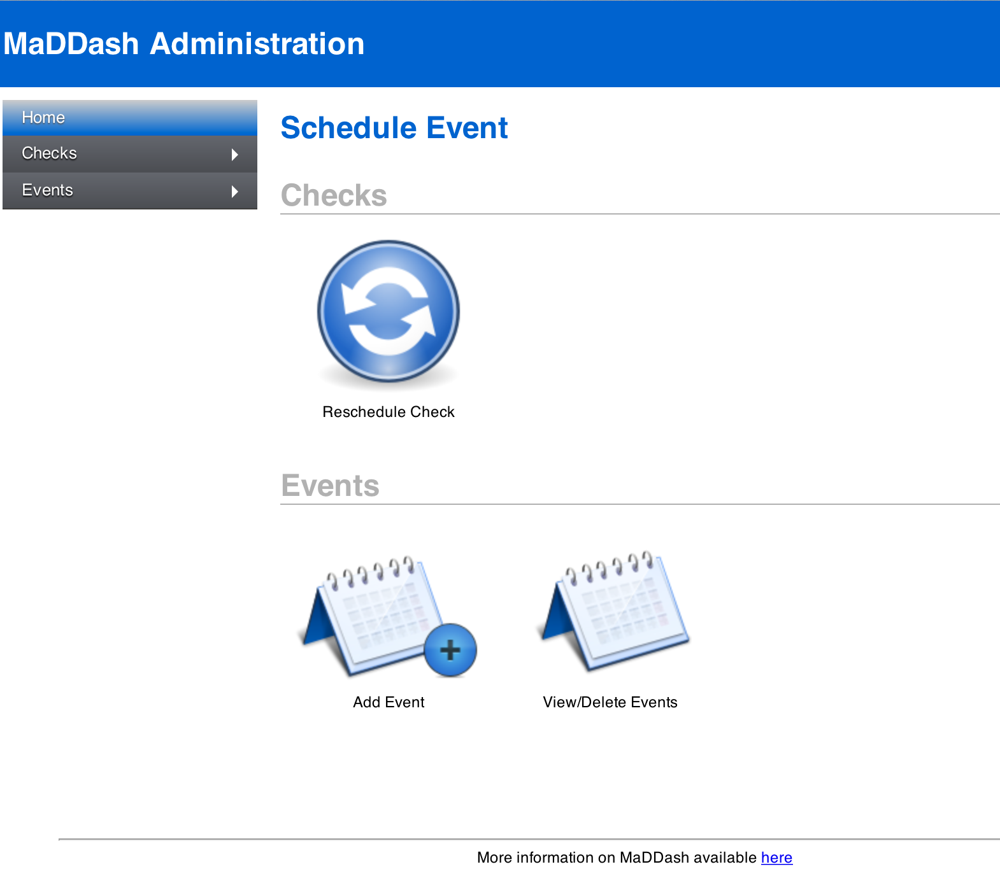

***************************
Administrator Web Interface
***************************

.. note:: The administrator web interface was added in Version 1.2 of the toolkit and not present in prior versions of MaDDash.

The administrator web interface allows privileged users to perform special operations on the dashboard. The operations it allows include:

* Re-scheduling a check to run at a certain time.
* Scheduling an event, such as a maintenance window, that may impact check results
* Viewing and canceling existing events

The sections that follow describes how to create login credentials for this interface, access it, and perform supported operations.

.. _adminui-adduser:

Adding/Removing Administrative Users
=====================================
The administrator web interface requires a username and password through HTTP BASIC authentication to gain access to the page. By default no users are created. You may use Apache's *htpasswd* command to add users to the file */etc/maddash/maddash-webui/admin-users*. The command to add a user (e.g. *myadmin*) is shown below::

    htpasswd /etc/maddash/maddash-webui/admin-users myadmin

Follow the prompts to set the password. If you wish to remove a user then you may run the following command (replacing *myadmin* with the name of the user to be removed)::

    htpasswd /etc/maddash/maddash-webui/admin-users -D myadmin

.. note:: You must be logged-in to the command-line as a root user to run the commands above

.. _adminui-https:

Configuring HTTPS
=================
It is required that the administrator interface be run over HTTPS. By default any attempt to access the administrator interface will be forwarded to the HTTPS protected version of the site. By default, a self-signed SSL certificate is generated for you. It is recommended that you get a properly signed certificate for your page though. Since MaDDash sits behind Apache, the instructions for doing so are the same as any other Apache instance. It is recommended you read the `Apache SSL page <http://httpd.apache.org/docs/2.4/ssl/ssl_howto.html>`_  for further guidance.

.. _adminui-access:

Accessing the Administrator Web Interface
==========================================
You may access the interface by selecting *Server Settings...* from the *Settings* drop-down menu on the standard MaDDash web interface:

.. image:: images/maddash-server-settings.png

.. seealso:: If the menu above does not appear then see :ref:`config-webui-vizcustom` and the *enableAdminUI* option for more information on enabling this link.

Alternatively, you may access the page directly at *https://MYHOST/maddash-webui/admin* (where MYHOST is the address of your MaDDash web server). Upon reaching the page you will be prompted to login as an administrative user:

.. image:: images/maddash-access-login.png

.. seealso:: See :ref:`adminui-adduser` for the steps for creating an administrative user.

After entering your credentials you will be shown the home screen where you can navigate to areas in the page detailed in the remainder of this document:

.. _adminui-reschedule:

Rescheduling Checks
===================
It may be desirable to re-schedule a check or series of checks to run at a certain time. For example, if you have a throughput checks that runs twice a day, you may not wish to wait the full 12 hours for it to run again. This allows you to force it to run sooner than it would otherwise. Likewise you can push the next run time further out in the future. This is always a one-time change and after the newly scheduled execution time, the check will resume its previous schedule. 

The first step for using this feature through the web interface is to :ref:`access <adminui-access>` the administrator web interface and click *Reschedule Check* on the home screen or in the left-hand menu.

.. image:: images/maddash-reschedule-access.png

The page that loads contains a set of menus to select the checks you want rescheduled and fields to set the time you want the checks run. See :ref:`adminui-filters` for more information on how to use the selection menus. Select the checks you want, set the time and hit schedule to reschedule checks. A message should appear indicating the number of checks that were updated. For example, below updates all check in the BWCTL grid to run at January 1, 2015 at 9:00AM EST:

.. image:: images/maddash-reschedule-example.png

.. note:: Note that depending on how busy MaDDash is it may not run the checks at exactly the time selected, but will do its best to run them as close as possible to that time. Likewise, if you set it to a the present time or in the past, the checks will be run as soon as possible. 

.. _adminui-events-add:

Scheduling Events
==================
The web interface allows you to schedule an **event**. In the MaDDash context an event is a period of time where the results of a check may be impacted by a known occurrence. For example, if you are running throughput checks and know that a certain set of hosts will be down for maintenance, you can mark the occurrence through this interface. You can opt to temporarily pause checks from running during this time or you can opt to keep them running. Regardless, a note will be displayed on the MaDDash user interface indicating the event's existence which should help inform users if unexpected results are reported during the allotted time. Also, if you opt to temporarily disable a check, it will be marked with a special color (default: black) to indicate that it is not running. 

In order to schedule an event, you must first :ref:`access <adminui-access>` the administrator web interface and click *Schedule Event* on the home screen or in the left-hand menu.

.. image:: images/maddash-addevent-access.png

The page that loads contains a set of menus to select the checks that will be affected by the event. It also contains fields to populate the details of the event. See :ref:`adminui-filters` for more information on how to use the selection menus. The fields describing the event have the following meaning:

.. glossary::

    Name
        A short label used to identify the event
    
    Description
        A longer description that provides important details about the event. 
        
    Start Time
        The date and time that the event starts
        
    End Time
        The date and time that the event ends
        
    Mark checks as down during event
        A checkbox indicating whether the check should be paused for the duration of the event. If selected then the checks will not run and will have a special color in the dashboard (default: black).
        
After populating all the fields, you may click schedule to create the event. A message should display indicating the event was scheduled:

.. image:: images/maddash-addevent-scheduled.png

Viewing Existing Events
=======================
To view events you must first :ref:`access <adminui-access>` the administrator web interface and click *View/Delete Event* on the home screen or in the left-hand menu. 

.. image:: images/maddash-viewevent-access.png

The page that loads will contain a list of events. See :ref:`adminui-events-add` for the meaning of each column.

.. image:: images/maddash-viewevent-list.png

Canceling Events
=================
To cancel an event you must first :ref:`access <adminui-access>` the administrator web interface and click *View/Delete Event* on the home screen or in the left-hand menu. 

.. image:: images/maddash-viewevent-access.png

The page that loads will contain a list of events. Next to each event is a remove button labelled with a *-*. Click this button and follow the prompt to delete an event.

.. image:: images/maddash-delevent-process.png

The event should now be deleted.

.. note:: If you would like to modify an event you must first delete it then re-add it through the :ref:`scheduling interface <adminui-events-add>` 

.. _adminui-filters:

Selecting Checks
=================

At the top of many of the pages you will see four drop-down menus used to select the checks to which you want an operation performed. A good analogy for this interface is email filters you may set in your mail client that matches against items like subject, to address, from address, etc and then performs some actions on mail that match those filters (e.g. move them to a special folder). In this case we are not matching emails but instead checks to be performed by MaDDash. Each menu matches against the grid, row, column and check name respectively. By default, every menu is set to *any* meaning every check performed by MaDDash will be selected. 

.. image:: images/maddash-select-all.png

You may use the drop down menus to further refine your selection. The other end of the spectrum would be to select exactly one check by specifying a value for each of the menus. For example:

.. image:: images/maddash-select-one.png

Of course often times the operation you will want to perform will fall somewhere in between one check and all checks. The interface allows flexibility on how the checks are selected. Beyond the initial four menus, the *+* and *-* buttons will add and remove additional filters respectively of the same type. It essentially creates an OR condition for filters of that type. For example if you want to match only the checks in the BWCTL or OWAMP grids, but ignore any other grids, then you may click the *+* to add another grid filter and select the two grids you want from the menus:

.. image:: images/maddash-select-grids.png

You can do the same thing for the row (which corresponds to the labels on the left-hand side of a dashboard), the column (which corresponds to the labels on the top of a dashboard), and check names. There is a special checkbox labeled *Filter on row and column simultaneously* that allows you to match against either row or column. For example, if your rows and columns represent hosts and you want to match a host regardless whether its in the row or column then use this checkpox. For example, the filters below will match and check involving albq-pt1.es.net regardless of whether it is a row or column:

.. image:: images/maddash-select-rowcol.png

